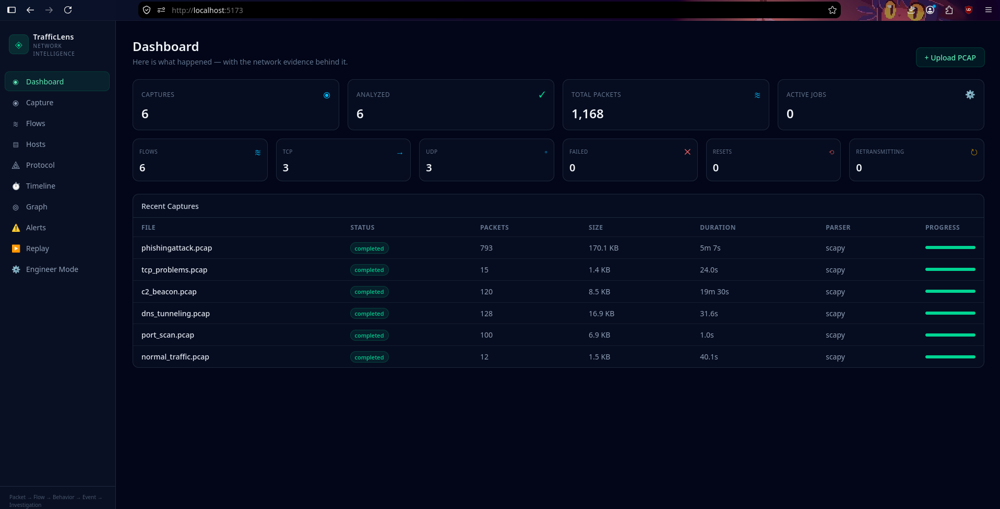

<p align="center">
  
</p>

[](https://github.com/besafewithsamy/PacketSleuth/actions/workflows/ci.yml)  

    

**Network traffic analysis and investigation, built around understanding what happened.**

PacketSleuth turns raw network traffic into a clear picture of network activity. Instead of forcing you to work through thousands of packets to understand an incident, it reconstructs the traffic into flows, hosts, protocols, behaviors, events, and alerts — while keeping the underlying packets available as evidence.

> Here is what happened. Let me show you the network evidence behind it.

```text
Packets → Flows → Hosts → Behaviors → Events → Investigation
````

## Overview



## What PacketSleuth Does

### Traffic Investigation

* Live interface capture with BPF filtering and auto-stop
* Reconstructs bidirectional TCP and UDP flows
* IPv4 and IPv6 traffic with correct internal/external direction classification
* Tracks packets, bytes, duration, and direction
* Detects retransmissions, resets, and connection failures
* Provides packet-level evidence for investigations

### Host & Protocol Analysis

* Builds profiles for observed hosts
* Identifies services, ports, and communication relationships
* Reconstructs DNS transactions (A and AAAA records)
* Analyzes HTTP requests and responses
* Extracts TLS sessions with SNI and negotiated version
* Labels QUIC (HTTP/3) traffic on UDP 443
* Extracts plaintext protocol banners (SSH, SMTP, FTP)
* Decodes DHCP conversations (DORA) with client hostnames
* Provides protocol-level behavioral statistics

### Suspicious Activity Detection

PacketSleuth uses deterministic and explainable rules rather than relying on black-box machine learning.

Current detections include:

* Port scanning
* C2-style beaconing
* Low-and-slow beaconing (long-interval periodic check-ins)
* DNS tunneling indicators
* DGA (algorithmically-generated domain) indicators
* NXDOMAIN bursts
* ARP spoofing (IP claimed by multiple MACs)
* Lateral movement (internal fan-out on admin ports)
* Data exfiltration (volume + first-contact correlation)
* Suspicious ports
* Excessive connection failures
* Direct-IP connections without DNS
* Unusually high outbound traffic
* Suspicious user agents

Each alert provides a score, severity, explanation, detection reasons, supporting evidence, and related flows.

Related alerts are also correlated into **incidents** — per-host groups of alerts that belong to one campaign — with a plain-English story of what happened.

### Timeline, Graph & Replay

PacketSleuth turns network activity into an investigation timeline that can be filtered by host, protocol, event type, severity, and time.

It also provides:

* Network relationship graphs
* Chronological event timelines
* Incident replay
* Flow and packet drill-down

### Cases & Investigation Workflow

* Group related captures into a **case** — one incident, one story
* Merged chronological timeline across every capture in the case
* Case-level statistics: total packets, alerts, correlated incidents
* One-click **HTML investigation report** (printable to PDF) with alerts, reasons, evidence, incidents, and timeline highlights
* Alert triage: tag as `confirmed`, `false-positive`, or `escalated`, add analyst notes, and filter out triaged alerts
* Alert → flow deep links that jump straight to the packet evidence

### Network Engineering

PacketSleuth is not limited to security investigations. It also provides network health information including:

* Bandwidth and packet rates
* Top talkers
* TCP health
* DNS health
* Traffic distribution
* Network issues

## Quick Start


### One command with Docker (no prerequisites except Docker)

```bash
docker compose up
```

Then open [http://localhost:8000](http://localhost:8000) — the full app (frontend + API) runs in a single container, with analysis data persisted in a named volume.

### Requirements (manual setup)

* Python 3.12+
* Node.js 18+
* npm

### Backend

```bash

cd ~/Projects/PacketSleuth/backend

source .venv/bin/activate

python -m uvicorn app.main:app --reload --port 8000

```

The API will be available at:

[http://localhost:8000](http://localhost:8000)

Interactive API documentation:

[http://localhost:8000/docs](http://localhost:8000/docs)

### Frontend

Open another terminal:

```bash

cd ~/Projects/PacketSleuth/frontend

npm run dev
```

Then open:

[http://localhost:5173](http://localhost:5173)

## Test Data

PacketSleuth includes a deterministic PCAP generator for development and testing.

From the `backend` directory with the virtual environment activated:

```bash
python ../scripts/generate_test_pcaps.py --out ../test-data/synthetic
```

The generator includes scenarios such as:

* Normal traffic
* Port scanning
* DNS tunneling
* C2-style beaconing
* Low-and-slow beaconing
* TCP connection problems
* ARP spoofing
* Lateral movement
* Data exfiltration
* DGA domains
* IPv6 traffic
* QUIC traffic
* Protocol banners (SSH/SMTP/FTP)
* DHCP lease

## Architecture

PacketSleuth separates packet parsing from the analysis engine through a normalized internal model.

```text
PCAP
  │
  ▼
Packet Parser
  │
  ├── Scapy
  └── TShark
  │
  ▼
Normalized Packets
  │
  ├── Flow Reconstruction
  ├── Protocol Analysis
  ├── Host Profiling
  └── Behavioral Analysis
          │
          ▼
        Alerts
          │
          ▼
 Timeline / Graph / Replay
          │
          ▼
     Investigation
```

Parser-specific objects do not leave the parser layer. This keeps the analysis engine independent from the underlying packet parser and makes it possible to add additional parsers in the future.

## Project Structure

```text
PacketSleuth/
├── backend/
│   ├── app/
│   │   ├── api/
│   │   ├── core/
│   │   ├── db/
│   │   ├── parsers/
│   │   ├── repositories/
│   │   ├── schemas/
│   │   └── services/
│   └── tests/
│
├── frontend/
│   └── src/
│       ├── api/
│       ├── components/
│       ├── pages/
│       └── types/
│
├── scripts/
│   └── generate_test_pcaps.py
│
└── test-data/
```

## Tech Stack

### Backend

* Python
* FastAPI
* SQLAlchemy
* SQLite
* Scapy
* Pydantic

### Frontend

* React
* TypeScript
* Vite
* Tailwind CSS
* Zustand
* TanStack Table
* Cytoscape.js
* Recharts

## Testing

The project is covered by three test layers, all wired into GitHub Actions CI:

**Backend** — 113 integration tests (pytest) over the full analysis pipeline:

```bash
cd backend
source .venv/bin/activate
pytest tests/ -q
```

**Frontend unit tests** (vitest):

```bash
cd frontend
npm test
```

**End-to-end smoke** (Playwright) — boots both servers and drives the real UI: upload → analyze → alerts. Self-contained:

```bash
cd frontend
npx playwright test
```

PacketSleuth also uses deterministic synthetic PCAPs to make analysis scenarios reproducible during development and testing.

## Live Capture

PacketSleuth can also record traffic directly from a network interface — no upload needed. On the **Capture** page:

1. Pick a network interface (and optionally a BPF filter, e.g. `tcp port 80`)
2. Press **Start live capture** — a live packet counter and auto-stop countdown appear
3. Press **Stop & analyze** (or let the auto-stop timer fire)

The recorded traffic is saved as a PCAP and flows through the exact same analysis pipeline as an upload — flows, hosts, alerts, timeline, everything.

> Note: live sniffing needs elevated permissions. Run the backend as root, or grant the Python process `CAP_NET_RAW`/`CAP_NET_ADMIN` capabilities. Interface listing and all other features work unprivileged.

## Roadmap

* Real-time streaming analysis of live captures
* PCAP analysis caching
* Additional protocol parsers

## Current Status

PacketSleuth is currently a local, single-user application focused on PCAP-based network investigation and analysis.

The core analysis pipeline, flow reconstruction, protocol analysis, behavioral detection, timeline, graph, replay, and network engineering features are implemented.

## Contributing

PacketSleuth is an evolving project. Contributions, ideas, bug reports, and improvements are welcome.

If you have an idea that could make network traffic easier to understand or investigate, feel free to open an issue or submit a pull request.


